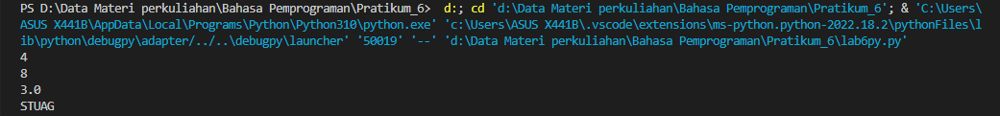
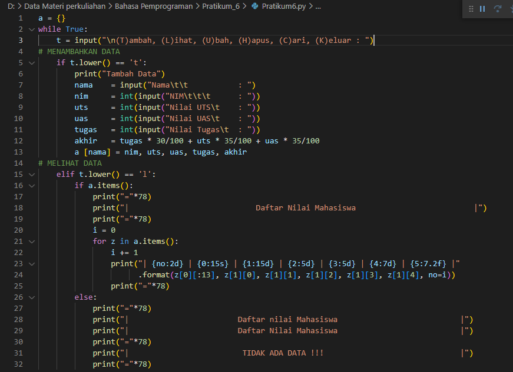
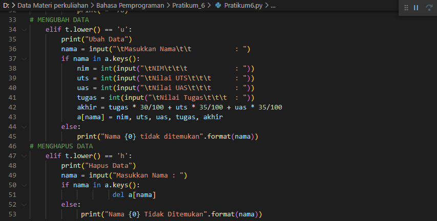
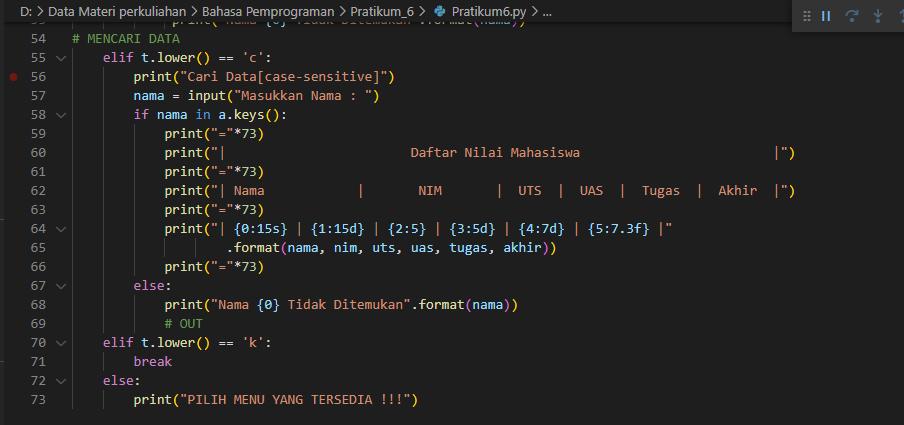
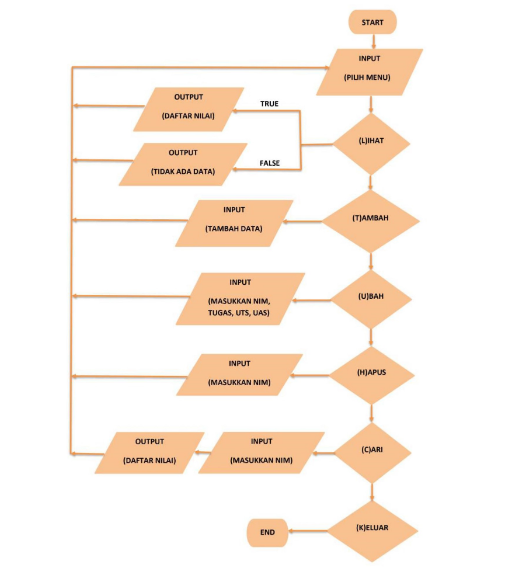

## Nama         :   Muhamad Ali M
## Kelas        :   TI.22.B2
## Mata kuliah  :   Bahasa Pemrograman

# 1.Latihan_1

input code

import math

def a(x):

    return  x**2

a = lambda x : x**2

print(a(2))

def b(x, y):

        return math.sqrt(x**2 + y**2)

b = lambda x, y : x ** 2 + y ** 2

print(b(2, 2))

def c(*args):

        return sum(args)/len(args)

c = lambda *args : sum(args)/len(args)

print(c(1,2,3,4,5))

def d(s):

        return "".join(set(s))

d = lambda s: "".join(set(s))

print(d("TUGAS"))

### Output

# B.Pratikum_6

Berikut adalah tampilan program sederhana dengan mengaplikasikan penggunaan fungsi yang akan menampilkan daftar nilai

mahasiswa, dengan ketentuan:

Fungsi tambah() untuk menambah data

Fungsi tapilkan() untuk menampilkan data

Fungsi hapus(nama) untuk menghapus data berdasarkan nama dan

Fungsi ubah(nama) untuk mengubah data berdasarkan nama

input code

flowchart

### Output PROGRAM

Terima kasih

